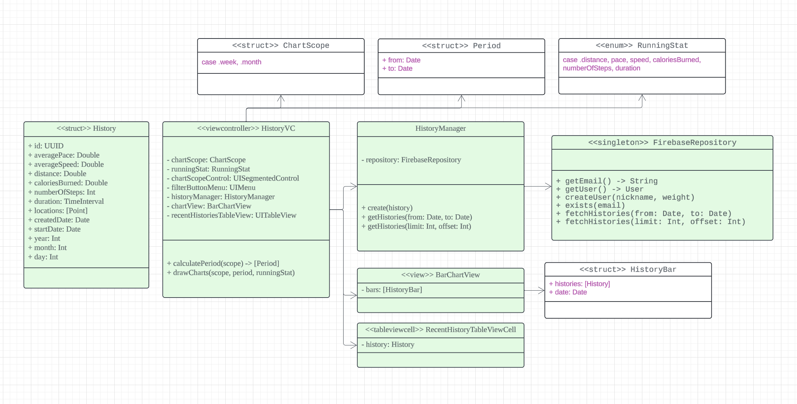

# RunPepperRun
iPhone 디바이스의 GPS, 자이로스코프, 가속도계 등을 이용하여 러닝을 하는 사용자의 러닝 루트, 거리, 속도, 소모 칼로리 등을 측정하고 저장하는 앱입니다. 좋은 설계와 iOS 스러운 디자인을 중점으로 개발했습니다.

> 개발기간 2023.11 ~ 2024.02

# 사용 기술
- Swift, UIKit
- CoreLocation, CoreMotion, Mapkit
- SnapKit, Charts
- Firebase Auth, Firestore

# 주요 기능

> Firebase Auth를 통한 구글 로그인

    
    

> MKMapView, CoreLocation을 활용한 유저의 위치, 러닝 루트 표시

    

> CoreMotion을 통해 속도, 페이스, 칼로리 표시

    

> Firestore에 러닝 결과 저장 및 표시

    

> UISegmentedControl, UIMenu를 통해 필터링한 러닝 데이터 필터링

    
    

> 필터링된 데이터를 Charts를 활용하여 도식화

    
    

> 커스텀 Spinner와 lastSnapshot을 이용한 Firestore Pagination

    

# 설계
## 러닝 

    

> LucidChart 이용

### Running
- 시작, 멈춤, 재개 등 상태 관리
- 속도, 칼로리, 페이스, 케이던스, 러닝시간, 러닝거리 등에 필요한 값을 다양한 하드웨어로부터 받아서 계산 후 가지고 있다가 UI에 delegate로 전달

### Motion
- Pedometer에서 pace, speed, cadence 값을 받아서 Running에 전달
- Pedometer에서 받은 speed, startDate, endDate로 distance를 계산해서 Running에 전달
- ActivityManager에서 Motion 상태를 받아서 calories 계산 후 Running에 전달 [칼로리 계산식](https://downhilltodowntown.com/how-to-calculate-your-caloric-burn-while-running/)

### Location
- CLLocation 모듈이 다른 모듈에 영향을 미치지 않도록 Point 구조체로 래핑

## 히스토리
- 저장될 러닝 결과를 의미
- ResultVC로 부터 생성된 RunningResult로 생성

> Visual Paradigm 이용

    

### HistoryChartManager
- History를 Charts에 표시할 수 있도록 HistoryBar로 변경
- 변경된 HistoryBar로 Chart를 그림

### FirebaseRepository
- Firestore로부터 데이터를 불러옴

### ChartScope, Period
- UISegmentedControl을 주, 월로 바꿀 때마다 현재 날짜로부터 계산하여 최근 4주 혹은 지난달, 이번달의 기간(Period)을 생성

# 아키텍처

> MVC 패턴을 채용하였으며 M은 Model, V는 View, C는 Controller를 나타냅니다.

    

Model은 데이터와 데이터를 변환하는 로직을 담당하고 View는 UI를 가지고 있으며 둘 사이의 Controller는 비즈니스 로직을 담당한다.

Controller가 Model의 데이터를 가공하여 View에 전달하며 View로부터 받은 이벤트를 Controller가 처리한다.

1. View가 Controller에 액션을 보낸다.
2. Controller가 Model을 업데이트 한다.
3. Model의 변화를 Controller에 알린다.
4. Controller가 View를 업데이트 한다.

애플의 MVC 구조는 View와 Model이 서로 알필요가 없게 한다. iOS에서는 View가 VC의 라이프사이클과 깊은 연관이 있어 VC와 View가 보다 깊은 관계를 가지고 VC가 모든일을 하게 된다.

# 커밋 메시지 규칙
> 코드 리뷰를 받는데 있어 커밋 메시지로 커밋 내 코드가 어떤지 명확히 보기 위하여 프로젝트 중간 커밋 메시지 규칙을 도입했습니다.

[Feat] - 기능 추가 
[Fix] - 기능 수정 
[Refactor] - 구조 변경 
[Chore] -  자잘한 수정 
[Build] - 모듈, 빌드 관련 
[Style] - 코드 스타일, 컨벤션 관련 
[Perf] - 성능 개선 

# 블로그
> 프로젝트를 진행하여 공유하고 싶은 내용을 블로그에 작성하였습니다.

[iOS 시뮬레이터 GPX를 통한 위치 변경 테스트](https://medium.com/peppermint100/ios-%EC%8B%9C%EB%AE%AC%EB%A0%88%EC%9D%B4%ED%84%B0-gpx%EB%A5%BC-%ED%86%B5%ED%95%9C-%EC%9C%84%EC%B9%98-%EB%B3%80%EA%B2%BD-%ED%85%8C%EC%8A%A4%ED%8A%B8-85af7038c29a) 
[Pods 파일들을 깃에 올려야 할까?, Commit 수정하기](https://medium.com/peppermint100/cocoapods%EC%9D%84-%EA%B9%83%EC%97%90-%EC%98%AC%EB%A0%A4%EC%95%BC-%ED%95%A0%EA%B9%8C-commit-%EC%88%98%EC%A0%95%ED%95%98%EA%B8%B0-ae785e2049b2) 
[소프트웨어는 설계가 중요하구나
](https://medium.com/peppermint100/%EC%86%8C%ED%94%84%ED%8A%B8%EC%9B%A8%EC%96%B4%EB%8A%94-%EC%84%A4%EA%B3%84%EA%B0%80-%EC%A4%91%EC%9A%94%ED%95%98%EA%B5%AC%EB%82%98-5a3d686db983) 

